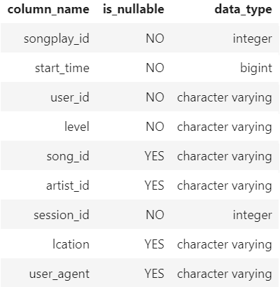
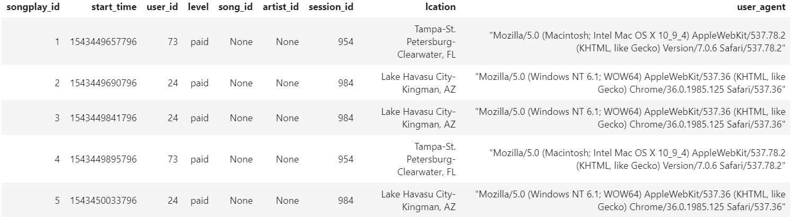
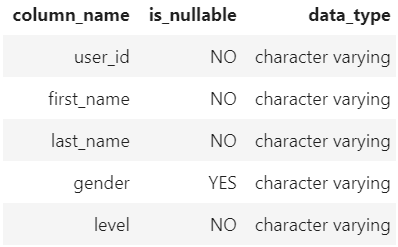
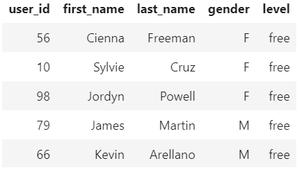
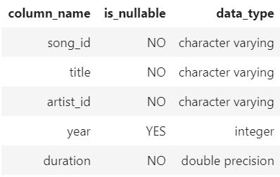
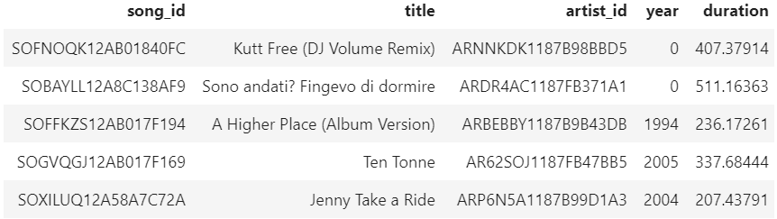
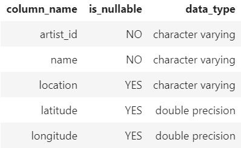
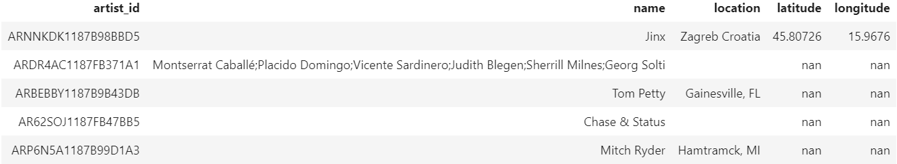
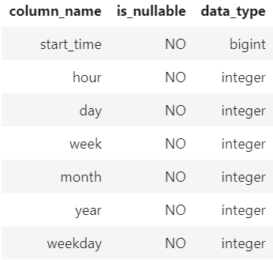
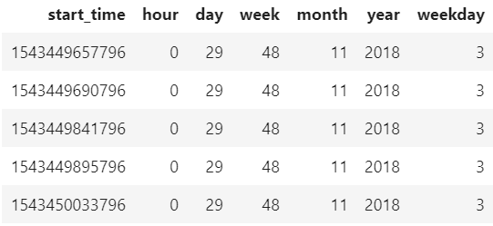

# Data Modeling with Postgres

## Required libraries

- pandas
- psycopg2
- sql_queries

## Motivation

desenvolvimento de projeto para Etapa de Seleção

## Project

As tabelas criadas devem ser normalizadas e armazenadas no PostgreSQL. Além disso, para analisar a atividade do usuário, as tabelas de Fato e Dimensão devem ser criadas a partir de metadados de músicas e logs de atividades do usuário.

## Files

- etl.ipynb: este caderno para desenvolver o processo ETL para cada tabela
- test.ipynb: este notebook para testar sql_queries.py e elt.ipynb (etl.py) 
- create_tables.py: criar banco de dados e tabelas
- elt.py: definir o processo ETL
- sql_queries.py: definir as consultas SQL

## Esquema de banco de dados para análise de reprodução de música

Usando o banco de dados, criei um esquema em estrela desnormalizado otimizado para agregações rápidas e consultas simplificadas na análise de reprodução de músicas. Isso inclui uma tabela de fatos de ** songplays ** e quatro tabelas de dimensão para ** usuários, músicas, artistas e tempo **:


## Data

### Songs metadata

Os arquivos são particionados pelas três primeiras letras do ID da faixa de cada música. Por exemplo, aqui estão os caminhos de arquivo para dois arquivos neste conjunto de dados.

```
song_data/A/B/C/TRABCEI128F424C983.json
song_data/A/A/B/TRAABJL12903CDCF1A.json
```

E abaixo está um exemplo da aparência de um único arquivo de música, TRAABJL12903CDCF1A.json.

```
{"num_songs": 1, "artist_id": "ARJIE2Y1187B994AB7", "artist_latitude": null, "artist_longitude": null, "artist_location": "", "artist_name": "Line Renaud", "song_id": "SOUPIRU12A6D4FA1E1", "title": "Der Kleine Dompfaff", "duration": 152.92036, "year": 0}
```

### User activity logs


Os arquivos de log no conjunto de dados com o qual você trabalhará são particionados por ano e mês. Por exemplo, aqui estão os caminhos de arquivo para dois arquivos neste conjunto de dados.

```
log_data/2018/11/2018-11-12-events.json
log_data/2018/11/2018-11-13-events.json
```

E abaixo está um exemplo de como é um único registro de atividades em 2018-11-13-events.json.

```
{"artist":null,"auth":"Logged In","firstName":"Kevin","gender":"M","itemInSession":0,"lastName":"Arellano","length":null,"level":"free","location":"Harrisburg-Carlisle, PA","method":"GET","page":"Home","registration":1540006905796.0,"sessionId":514,"song":null,"status":200,"ts":1542069417796,"userAgent":"\"Mozilla\/5.0 (Macintosh; Intel Mac OS X 10_9_4) AppleWebKit\/537.36 (KHTML, like Gecko) Chrome\/36.0.1985.125 Safari\/537.36\"","userId":"66"}
```

## ETL Processes

O resumo dos processos ETL está abaixo.
Para obter mais detalhes, consulte etl.ipynb, etl.py e sql_queries.py.

### Songs metadata

#### #1: songs table

- Analise e leia um arquivo JSON de música usando a função pandas.read_json.
- Selecione as colunas de ID da música, título, ID do artista, ano e duração do dataframe.
- Execute uma consulta de inserção na tabela de músicas no PostgreSQL.
  - Se ocorrer um conflito de ID de música, não faça nada.
- Repita o processo iteravelmente para todos os dados de músicas.

#### #2: artists table

- Analise e leia um arquivo JSON de música usando a função pandas.read_json.
- Selecione colunas para a ID do artista, nome, localização, latitude e longitude do dataframe.
- Execute uma consulta de inserção na tabela de artistas no PostgreSQL.
  - Se ocorrer um conflito de ID de artista, não faça nada.
- Repita o processo iteravelmente para todos os dados de músicas.

### User activity logs

#### #3: time table

- Analise e leia um arquivo JSON do log de atividades do usuário usando a função pandas.read_json.
- Filtre os registros por ação NextSong.
- Converta a coluna de carimbo de data / hora ts em data e hora.
- Extraia o carimbo de data / hora, hora, dia, semana do ano, mês, ano e dia da semana do dataframe.
- Execute uma consulta de inserção à tabela de tempo no PostgreSQL.
- Repita o processo iteravelmente para todos os arquivos de log.

#### #4: users table

- Analise e leia um arquivo JSON do log de atividades do usuário usando a função pandas.read_json.
- Filtre os registros por ação NextSong.
- Selecione colunas para ID de usuário, nome, sobrenome, gênero e nível do dataframe.
- Execute uma consulta de inserção na tabela de músicas no PostgreSQL.
  - Se houver conflito de ID do usuário, atualiza o valor do nível no registro.
- Repita o processo iteravelmente para todos os arquivos de log.
- 
#### #4: songsplays table

- Analise e leia um arquivo JSON do log de atividades do usuário usando a função pandas.read_json.
- Filtre os registros por ação NextSong.
- Selecione o carimbo de data / hora, ID do usuário, nível, ID da música, ID do artista, ID da sessão, local e agente do usuário do dataframe.
  - Os arquivos de registro não incluem o ID da música e o ID do artista, portanto, obtenha esses ID executando a consulta de seleção nas tabelas de músicas e artistas.
- Execute uma consulta de inserção na tabela de músicas no PostgreSQL.
- Repita o processo iteravelmente para todos os arquivos de log.
## Usage

Crie tabelas e execute ETL.

```
$ python create_tables.py
$ python etl.py
```

## Result tables

### Fact Table

#### songplays - records in log data associated with song plays.
- table description


- examples


### Dimension Tables

#### users - users in the app
- table description


- examples


#### songs - songs in music database
- table description


- examples


#### artists - artists in music database
- table description


- examples


#### time - timestamps of records in songplays broken down into specific units
- table description


- examples


## Acknowledgements

I wish to thank Udacity for advice and review.
